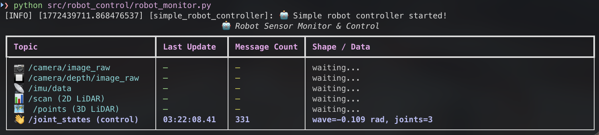

# humanoid-sim

**humanoid-sim** is a turnkey ROS2 simulation environment for humanoid robots, designed to run entirely inside Docker on macOS with no native ROS installation required.

It currently supports the **Unitree G1** and **Astribot S1**, and is built to extend — adding a new robot takes one config entry and a sensor XACRO file. Each robot is equipped with five fully functional sensors out of the box: a 2D LiDAR, a 3D LiDAR, an RGB camera, a depth camera with point cloud output, and an IMU — all publishing on standard ROS2 topic names and message types.

The focus is on **sensor data workflows**: collecting, recording, and processing perception data in simulation before deploying to hardware. Bags can be recorded in MCAP or SQLite3 format directly from the launch command. Because all topics use standard `sensor_msgs` types and the same names as the physical robots, code written against the simulation runs on real hardware without modification — only `use_sim_time:=false` needs to change.


*Live sensor monitoring and robot control using the included Python scripts*

---

Each robot ships with five sensors:

| Topic | Type | Source |
|-------|------|--------|
| `/scan` | `LaserScan` | 2D LiDAR |
| `/points` | `PointCloud2` | 3D LiDAR |
| `/camera/image_raw` | `Image` | RGB camera |
| `/camera/rgbd/depth/image_raw` | `Image` | Depth image (32FC1, metres) |
| `/camera/rgbd/points` | `PointCloud2` | Depth point cloud |
| `/imu/data` | `Imu` | IMU |
| `/joint_states` | `JointState` | All joints |

---

## Prerequisites

| Tool | Purpose | Install |
|------|---------|---------|
| [Docker Desktop](https://www.docker.com/products/docker-desktop) | Run ROS2 simulation | **Required** |
| [TigerVNC Viewer](https://tigervnc.org) | View Gazebo GUI | Optional (GUI only) |
| [uv](https://docs.astral.sh/uv/) | Python package manager | Optional (Python scripts) |

**TigerVNC one-time setup** (if using GUI):
```bash
brew install --cask tigervnc-viewer
```

> **Note:** XQuartz X11 forwarding does not work for this simulation on Apple Silicon Macs — Gazebo's OpenGL renderer crashes when forwarded over XQuartz. The simulation uses an internal virtual display (Xvfb) with a VNC server instead.

**uv installation** (if running Python scripts):
```bash
curl -LsSf https://astral.sh/uv/install.sh | sh
```

---

## Setup

This is a complete first-time setup guide. Each step only needs to be run once.

### 1. Clone the repository

```bash
git clone https://github.com/fortyfive-labs/humanoid-sim.git
cd humanoid-sim
```

### 2. Create the Gazebo cache volume

```bash
docker volume create sim_robo_gazebo-cache
```

This Docker volume persists Gazebo's model database between container restarts. **Without this**, Gazebo will re-download ~300MB of models on every launch (takes ~8 minutes). With it, only the first launch is slow.

### 3. Build the Docker image

```bash
docker compose build
```

This builds an Ubuntu 22.04 image with ROS2 Humble, Gazebo Classic 11, and all dependencies. First build takes **~5–10 minutes**. Subsequent builds use cached layers and are much faster.

### 4. Build the ROS2 workspace

```bash
# Start the container
docker compose run --rm sim bash

# Inside the container - you'll see the prompt change to root@<container-id>
cd /workspace
colcon build

# Source the built packages
source install/setup.bash
```

The `colcon build` command compiles the Python ROS2 packages in `src/`. This step takes ~30 seconds and only needs to be repeated if you modify the package source code.

**What gets built:**
- `g1_description` and `astribot_description` - Robot URDF models with sensors
- `g1_gazebo` - Gazebo world files
- `sim_gazebo` - Multi-robot launch system
- `g1_apps` - Example Python nodes for subscribing and control

### 5. (Optional) Install Python dependencies

If you want to run the Python monitoring and control scripts:

```bash
# Inside the container
cd /workspace
# Pin to system Python 3.10 so rclpy C extensions are compatible
uv sync --python /usr/bin/python3
source .venv/bin/activate
```

This installs pure Python dependencies like `rich` (terminal UI library). ROS2 packages (`rclpy`, `sensor_msgs`) come from the system installation and don't need to be installed separately.

---

## Launching the Simulation

### Quick start

```bash
# Start the simulation with VNC display
docker compose run --rm --service-ports sim bash /workspace/start_sim.sh
```

Then open **TigerVNC Viewer** and connect to `localhost:5900`.

**First launch timing (ever):**
- ~8 minutes for Gazebo to download its model database (one-time; cached in the Docker volume after this)
- ~3–5 minutes for the Gazebo window to appear in VNC (OGRE shader compilation — one-time per volume, cached after)
- Non-camera topics (`/scan`, `/points`, `/imu/data`, `/joint_states`) appear within seconds of robot spawn
- Camera topics appear ~30–40 s after spawn (shader compilation; faster on subsequent runs)

**Subsequent launches** (model and shader cache warm): robot spawns in ~5 s, all topics appear within ~10 s.

Topics start publishing after the robot spawns. You can verify them with `ros2 topic list`.

### Launch command reference

```bash
# Unitree G1 with GUI (default)
ros2 launch sim_gazebo sim.launch.py

# Astribot S1 with GUI
# Note: Astribot's URDF uses .glb mesh files which Gazebo Classic doesn't render.
# The robot spawns and all sensors publish correctly; only the 3D visual is missing.
ros2 launch sim_gazebo sim.launch.py robot:=astribot

# Headless mode (no GUI window, faster startup)
ros2 launch sim_gazebo sim.launch.py gui:=false

# Start paused (useful for debugging)
ros2 launch sim_gazebo sim.launch.py paused:=true

# Record all sensor topics to MCAP bag file
ros2 launch sim_gazebo sim.launch.py rosbag:=true

# Record to SQLite3 format instead
ros2 launch sim_gazebo sim.launch.py rosbag:=true bag_format:=sqlite3

# Custom bag output path (bag_path is a directory name, not a file)
ros2 launch sim_gazebo sim.launch.py rosbag:=true bag_path:=/workspace/bags/my_experiment

# RViz2 robot preview only (no physics simulation)
ros2 launch g1_description display.launch.py
ros2 launch astribot_description display.launch.py
```

### All launch arguments

| Argument | Default | Options |
|----------|---------|---------|
| `robot` | `g1` | `g1`, `astribot` |
| `gui` | `true` | `true`, `false` |
| `paused` | `false` | `true`, `false` |
| `use_sim_time` | `true` | `true`, `false` |
| `rosbag` | `false` | `true`, `false` |
| `bag_format` | `mcap` | `mcap`, `sqlite3` |
| `bag_path` | *(auto)* | any path |

Bags are saved to `bags/` in the repo root (volume-mounted, visible on macOS).

---

## Verifying Topics

After launching the simulation, you can inspect the ROS2 topics to verify everything is working.

```bash
# List all available topics
ros2 topic list

# Echo messages from a topic (Ctrl+C to stop)
ros2 topic echo /scan
ros2 topic echo /imu/data
ros2 topic echo /camera/image_raw --no-arr  # --no-arr hides large binary data

# Check topic publish rate
ros2 topic hz /camera/image_raw
ros2 topic hz /points

# Show topic message type
ros2 topic info /scan
ros2 topic info /camera/rgbd/points

# Display topic metadata
ros2 topic info /imu/data --verbose
```

**Expected output:**

All sensor topics should publish at the following rates:
- `/camera/image_raw` - 30 Hz
- `/camera/rgbd/depth/image_raw` - 15 Hz (32FC1 depth values)
- `/camera/rgbd/points` - 15 Hz
- `/imu/data` - 200 Hz
- `/scan` - 15 Hz (2D LiDAR)
- `/points` - 10 Hz (3D LiDAR)
- `/joint_states` - 50 Hz

> **Note:** Actual rates under software rendering (no GPU) may be lower — this is normal for Docker on macOS.

If topics aren't appearing, wait ~90 seconds for gzserver to fully initialize on first launch. The robot model must spawn before sensors activate.

---

## Python Scripts

The `src/robot_control/` directory contains Python scripts for monitoring and controlling robots. These demonstrate how to:
- Subscribe to ROS2 sensor topics (`/camera/image_raw`, `/imu/data`, `/scan`, `/points`)
- Publish joint commands to `/joint_states`
- Create live-updating terminal UIs with the Rich library
- Structure a ROS2 Python node with multi-threaded callbacks

Dependencies are managed with [uv](https://docs.astral.sh/uv/) at the project root.

### Robot Monitor Script

The `robot_monitor.py` script creates a live-updating dashboard that displays:
- 📷 RGB camera feed metadata (resolution, encoding, update rate)
- 🔲 Depth camera data (resolution, encoding)
- 📡 IMU acceleration values
- 📊 2D LiDAR scan statistics (ray count, distance range)
- 🗺️ 3D LiDAR point cloud info (point count, frame)
- 👋 Joint control output (wave motion command)

The script also sends sinusoidal joint commands to make the robot wave its right arm as a demonstration of control.

**Running inside Docker:**

```bash
# Terminal 1: Launch the simulation (headless, no VNC needed for monitor-only)
docker compose run --rm --service-ports sim bash -c "
  source /opt/ros/humble/setup.bash &&
  source /workspace/install/setup.bash &&
  ros2 launch sim_gazebo sim.launch.py gui:=false"

# Terminal 2: Run the monitor (exec into the running container)
docker exec -it $(docker ps -qf ancestor=sim_robo:humble) bash -c "
  source /opt/ros/humble/setup.bash &&
  source /workspace/install/setup.bash &&
  cd /workspace &&
  uv sync --python /usr/bin/python3 --quiet &&
  source .venv/bin/activate &&
  python3 src/robot_control/robot_monitor.py"
```

**Running locally on macOS:**

You can run the Python script natively on macOS while the simulation runs in Docker. This is useful for faster iteration and better terminal integration.

```bash
# Terminal 1: Start simulation in Docker (headless)
docker compose run --rm --service-ports sim bash -c "
  source /opt/ros/humble/setup.bash &&
  source /workspace/install/setup.bash &&
  ros2 launch sim_gazebo sim.launch.py gui:=false"

# Terminal 2: Run monitor on macOS
# One-time setup (see RUNNING_LOCAL.md for full details):
conda create -n ros2 python=3.10
conda activate ros2
conda install -c conda-forge -c robostack-humble ros-humble-rclpy ros-humble-sensor-msgs
pip install rich  # install pure Python deps into the conda env

# Every session:
cd /path/to/humanoid-sim   # must be in the project root
conda activate ros2
export ROS_DOMAIN_ID=42
python3 src/robot_control/robot_monitor.py
```

The monitor will show a live table that updates at 10 Hz. Press `Ctrl+C` to exit.

See [RUNNING_LOCAL.md](RUNNING_LOCAL.md) for complete instructions on setting up ROS2 on macOS with conda.

### Scripts included

| Script | Description |
|--------|-------------|
| `robot_monitor.py` | Live sensor dashboard + simple arm wave control |
| `run.sh` | Convenience wrapper for Docker: runs `uv sync --python /usr/bin/python3` then launches the monitor |
| `run_monitor_local.sh` | Convenience wrapper for macOS with Homebrew ROS2: sources ROS2, sets `ROS_DOMAIN_ID=42`, runs the monitor via `uv run --system` |

---

## Project structure

```
humanoid-sim/
├── Dockerfile                     # Ubuntu 22.04 + ROS2 Humble + Gazebo Classic
├── docker-compose.yml
├── entrypoint.sh
├── start_sim.sh                   # Launch script: starts Xvfb+VNC then runs sim.launch.py
├── run_monitor_local.sh           # macOS convenience: source Homebrew ROS2 + run monitor
├── pyproject.toml                 # Python dependencies (rich, numpy) managed by uv
├── GUIDE.md                       # Full reference: launch, subscribe, record, real robot
└── src/
    ├── g1_description/            # Unitree G1 URDF, meshes, sensor XACRO
    ├── g1_gazebo/                 # Gazebo world
    ├── astribot_description/      # Astribot S1 URDF, meshes, sensor XACRO
    ├── sim_gazebo/                # Unified multi-robot launcher
    ├── g1_apps/                   # Template subscriber and joint controller nodes
    └── robot_control/             # Python scripts with uv (sensor monitor, control examples)
```

---

## Adding a new robot

1. Create `src/<name>_description/` with `urdf/<name>_sensors.urdf.xacro`
2. Add an entry to `ROBOT_CONFIGS` in `src/sim_gazebo/launch/sim.launch.py`
3. `colcon build --packages-select sim_gazebo <name>_description`

See `GUIDE.md` for the full sensor setup reference and real-robot migration guide.
